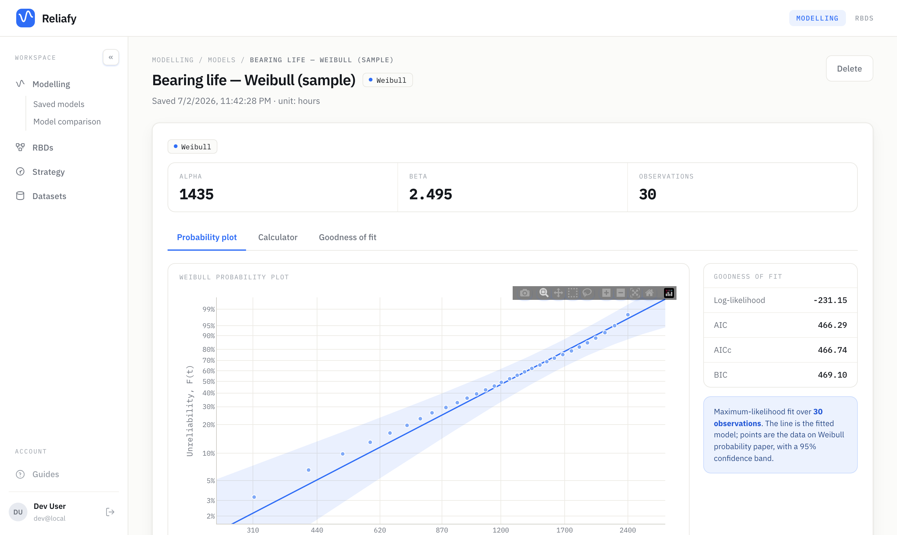

# Reliafy

**Open-source reliability engineering.** Fit life distributions to failure
data, build reliability block diagrams, and turn fitted models into maintenance
decisions — in one self-hostable web app.

A **FastAPI** backend does the statistics with
[SurPyval](https://github.com/derrynknife/SurPyval) and
[RePyability](https://github.com/derrynknife/RePyability) and serves a
**React** single-page frontend, so the whole app runs on a single port.



**Automate it:** the [ingestion API](docs/api.md) pushes meter readings,
inspection measurements, and new failure data from scripts and cron jobs. Fit
a model in a notebook and [push it from SurPyval](python/README.md)
(`pip install reliafy`).

**Where it's going:** see the [public roadmap](ROADMAP.md) — 👍 the
[roadmap issues](https://github.com/Reliafy/reliafy/issues?q=is%3Aissue+is%3Aopen+label%3Aroadmap+sort%3Areactions-%2B1-desc)
you want built first.

## Features

- **Life-distribution modelling** — fit Weibull, Exponential, Normal,
  Lognormal, Gamma, and proportional-hazards models to exact, censored, and
  truncated data. Probability plots on distribution-specific paper with
  confidence bounds, goodness-of-fit, and a survival calculator.
- **Reliability block diagrams** — wire components in series, parallel,
  k-out-of-n, and standby on a drag-and-drop canvas; compute system
  reliability, MTTF, importance measures, and minimal path/cut sets.
- **Degradation & RUL** — fit per-unit degradation paths to a failure
  threshold, then track in-service items and predict when each will cross it
  (remaining useful life with credible intervals).
- **RCM studies** — Function → Functional failure → Failure mode worksheets
  where every maintenance decision links to the analysis that justifies it,
  re-validated live (supported / contradicted / inconclusive).
- **Maintenance strategy** — rank candidate distributions against your data,
  compare two designs head-to-head, and find the cost-optimal
  preventive-replacement interval.
- **Datasets** — upload a CSV once and reuse it across models; saved models
  reopen instantly.

## Quickstart (self-hosted)

```
docker compose up --build
```

Open **http://localhost:8000**. That's it — no account or login (the instance
is yours, in single-user mode), data persists in a Docker volume, and a few
sample datasets, models, and an example RBD are pre-seeded so there's something
to explore.

## Configuration (self-host)

| Variable | Default | Purpose |
| -------- | ------- | ------- |
| `AUTH_DISABLED` | _(unset)_ | `true` = **single-user mode**: no login, every request is one fixed local user. The supported mode for self-hosting. |
| `DEV_USER_ID` | `dev-user` | The single user's id in single-user mode. |
| `MONGODB_URI` | _(unset)_ | MongoDB connection string. docker-compose wires this to its bundled MongoDB. Unset/unreachable ⇒ automatic fallback to an in-memory simulator (data **not** persisted; `GET /api/health` reports which). |
| `MONGODB_DB` | `reliafy` | Database name. |
| `SEED_SAMPLES` | `true` | Seed shared sample datasets/models/RBDs on startup (idempotent). |
| `PORT` | `8000` | Port the server listens on. |
| `ANTHROPIC_API_KEY` / `OPENAI_API_KEY` | _(unset)_ | Optional: set your own provider key to enable the built-in **AI assistant** on your instance (with `AI_PROVIDER` = `anthropic` (default) or `openai`, and optional `AI_MODEL`). Without a key the assistant is hidden. |

The frontend build has one flag: `VITE_AUTH_DISABLED=true` (a Docker build arg
in docker-compose) bakes single-user mode into the bundle — no login page and
no marketing pages, straight into the app.

## Local development

### Backend

```
python3.11 -m venv venv
source venv/bin/activate
pip install -r requirements.txt
AUTH_DISABLED=true uvicorn backend.main:app --port 8000 --reload
```

### Frontend

Hot-reload dev server (proxies `/api` to the backend on :8000;
`frontend/.env.development` already sets single-user mode):

```
cd frontend
npm install
npm run dev
```

Or a production build served by the backend on one port: `npm run build`, then
open http://localhost:8000.

### Tests

```
pip install pytest
pytest backend/tests
```

## Usage

1. Upload a CSV.
2. Map your columns to SurPyval inputs.
3. Fit, inspect the probability plot, and save the model.

### Column mapping

The mapping mirrors SurPyval's data model (`surpyval.utils.xcnt_handler`):

| Field | Meaning |
| ----- | ------- |
| `x`   | Observed values (exact / censored) |
| `c`   | Censor flag per row: `0` observed, `1` right, `-1` left, `2` interval |
| `n`   | Count of observations per row (positive integer) |
| `xl`  | Interval lower bound (used with `xr`) |
| `xr`  | Interval upper bound (used with `xl`) |
| `tl`  | Left truncation bound (`-inf` ⇒ untruncated) |
| `tr`  | Right truncation bound (`+inf` ⇒ untruncated) |

Rules enforced on both the frontend and backend:

- Use **`x`** *or* the **`xl`/`xr`** interval pair — never both.
- `xl` and `xr` must be supplied together.
- `c`, `n`, `tl`, `tr` are optional modifiers.

Left/interval-censored data is plotted with SurPyval's Turnbull estimator.

## How persistence works

Datasets, models, and RBDs are MongoDB documents (uploaded CSV bytes are stored
inline, content-addressed, on the dataset document). Saving a model stores the
fit recipe plus cached results, so reopening is instant; SurPyval models can't
be serialised, so covariate evaluation on a reopened proportional-hazards model
re-fits on demand from the dataset + spec.

## Reliafy Cloud

The hosted version at **Reliafy Cloud** adds what only makes sense hosted:
user accounts (Firebase sign-in), a Pro plan, a metered AI assistant on
prepaid credits, team workspaces (view free, edit with Pro), and view-only
sharing of any analysis with other accounts. The cloud code lives in this
same repository — GitLab-style, one codebase — and is **dormant unless
configured**: without Firebase/Stripe/AI env vars, none of it runs. Multi-user
env reference for operators:

| Variable | Purpose |
| -------- | ------- |
| `GOOGLE_CLOUD_PROJECT` / `FIREBASE_PROJECT_ID` | Firebase project whose ID tokens are accepted (multi-user mode). |
| `VITE_FIREBASE_*` | Public Firebase web config baked into the frontend build (`frontend/.env.production`). |
| `BILLING_ENABLED`, `STRIPE__API_KEY`, `STRIPE__WEBHOOK_SECRET`, `STRIPE__PRICE_ID` | Plans, credit packs, and the Stripe webhook. |
| `AI_PROVIDER`, `AI_MODEL`, `AI_MARKUP` | The metered assistant's provider/model/markup. |
| `PRO_MONTHLY_CREDIT_CENTS` | AI credit included with each month of Pro (granted per paid invoice; default 1000). |
| `ADMIN_EMAILS` | Comma-separated operator emails with full access regardless of payment (no plan caps, AI not credit-checked). |

## API (selected)

- `GET /api/config` — deployment capabilities `{auth, ai, billing}` (public).
- `GET /api/health` — liveness + storage mode (public).
- `GET /api/distributions` — `{id, name, covariates}` models that can be fit.
- `POST /api/columns` — multipart `file`; returns `{columns, preview, n_rows}`.
- `POST /api/fit/{distribution}` — multipart `file` plus any of the column
  fields `x, c, n, xl, xr, tl, tr`; returns parameters + probability-plot data.
- `POST /api/models` — fit and save; plus `GET`/`PATCH`/`DELETE
  /api/models/{id}` and `POST /api/models/{id}/evaluate`.
- `GET|POST /api/datasets`, `GET|DELETE /api/datasets/{id}`.
- `GET|POST /api/rbds`, `GET|DELETE /api/rbds/{id}`,
  `POST /api/rbds/analyze`, `POST /api/rbds/validate`.

## License

Reliafy is licensed under the **GNU Affero General Public License v3.0**
(AGPL-3.0) — see [LICENSE](LICENSE). You're free to use, modify, and self-host
it; if you offer a modified version as a network service, the AGPL requires you
to publish your modifications. Contributions are welcome — see
[CONTRIBUTING.md](CONTRIBUTING.md).
